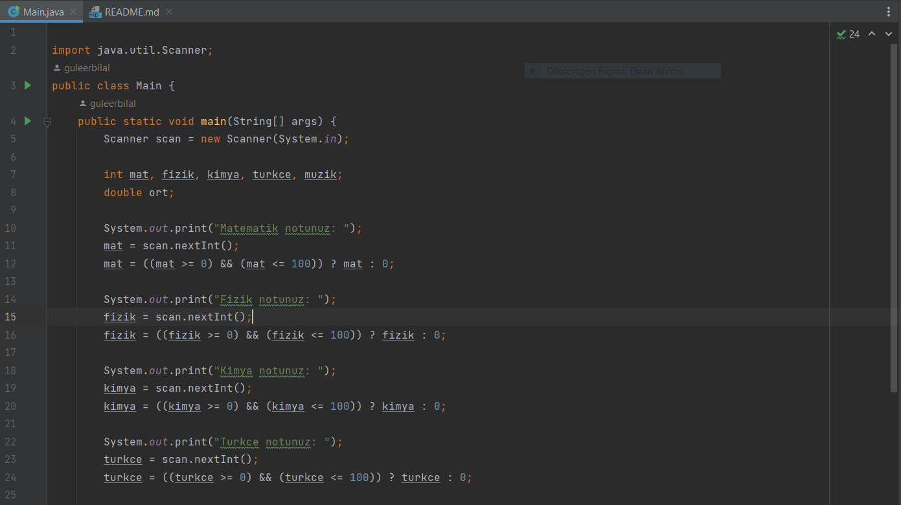
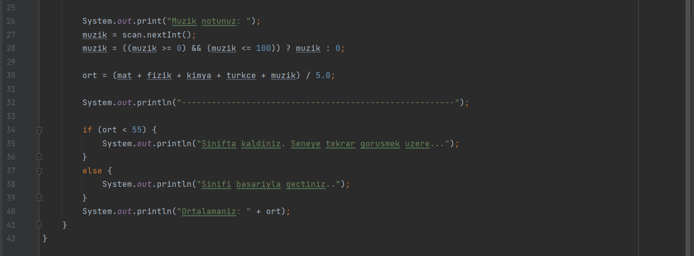
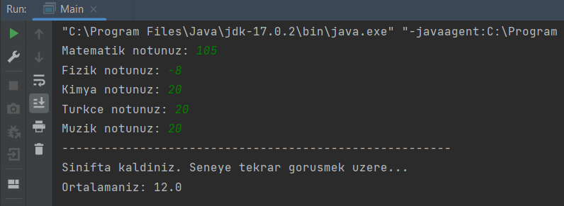

# MERHABA SINIFI GEÇME DURUMU HESAPLAYAN PROGRAMIMA HOŞ GELDİNİZ

* [**Patika.Dev Profil Linkim**](https://app.patika.dev/guleerbilal)

* Bu projemde verilen derslerin kullanıcı tarafından girilen notlara göre bir ortalama hesaplıyor ve o ortalamaya göre
sınıfta kalıp kalmadığını kontrol ediyor. Ayrıca girilen ders notları 100'ün üzerinde veya 0'ın altında olursa da bu
notları ortalama hesabına katmıyor.

## *Kodlarım*

*

*

*

